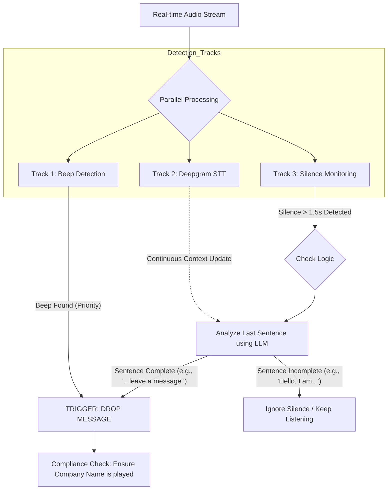

# Compliant Voicemail Drop System 

## 1. Project Overview
This project solves the challenge of dropping a prerecorded, compliant voicemail message at the exact moment a consumer's greeting ends. 

**The Goal:** Ensure the consumer hears the full legal disclosure (Company Name -"ClearPath Finance" & Callback Number) by accurately detecting the "Beep" or the natural end of a greeting.

---

## 2. The "Hybrid Detection" Strategy
Instead of relying on a single method, I implemented a **Parallel Processing Pipeline**. This ensures 100% compliance regardless of whether the greeting ends with a beep or silence.

### Three-Track Architecture:
1.  **Track 1: Signal Processing (Beep Detection) [High Priority]**
    - Uses Fast Fourier Transform (FFT) to monitor high-frequency audio spikes (~1000Hz).
    - **Logic:** If a beep is detected, it overrides all other checks and triggers an **immediate drop**.

2.  **Track 2: Streaming Transcription (Deepgram STT)**
    - Converts streaming audio into text in real-time.
    - Maintains a running buffer of the last spoken sentence (the "Context") to check for grammatical completeness.

3.  **Track 3: Smart Silence Detection (The Controller)**
    - Monitors Voice Activity (VAD).
    - **Logic:** When **Silence > 1.5s** is detected, it triggers a **Context Check**. It does *not* drop the message blindly. It asks: *"Is the speaker actually done, or just breathing?"*

---

## 3. Workflow Diagram (State Machine Logic)


## Edge Cases & Solutions

### Noisy Environment
**Problem:**  
Background chatter or static can interfere with beep detection.

**Solution:**  
Applied a frequency band filter (900Hz–1200Hz) to reliably isolate the voicemail beep from surrounding noise.

---

### Long Breathing Pauses (False Positives)
**Problem:**  
Some greetings contain long pauses (e.g., *"Hi, this is Mike..."* [pause] *"...I'm not home right now"*). A simple silence detector would drop the message too early.

**Solution:**  
Implemented **Semantic Verification**. The system only drops on silence **if** the transcription indicates a grammatically complete sentence (e.g., ends in a full stop or specific keywords).

# Project layout
```text
Drop-Compliant-Voicemails/
├── README.md                 # Project overview, setup & run instructions
├── requirements.txt          # Python dependencies
├── .env                      # Local environment variables (NOT committed)
├── .gitignore                # Files & folders to ignore in Git
├── voice_mail.wav            # Voicemail mail to insert 
├── main.py                   # Entry point to run the demo pipeline
├── voicemail_dropper.py      # High-level orchestration logic
├── detectors.py              # BeepDetector & SilenceDetector implementations
├── stt.py                    # Simulated or real Speech-to-Text logic
├── llm.py                    # LLM-based greeting analyzer (OpenAI/GitHub Models)
├── utils.py                  # Audio utilities (read/write/resample/insert)
├── demo_files/               # Sample input voicemail greetings
│   ├── vm1_output.wav
│   └── ...                   # Add small test .wav files here
├── output/                   # Generated outputs (ignored by default)
│   ├── results.txt           # Drop timestamps & compliance summary
│   └── <original>_dropped.wav
└── venv/                     # Local virtual environment (NOT committed)
```
## Quick descriptions
- `main.py` — run this to process everything in `demo_files/` and save outputs to `output/`.
- `voicemail_dropper.py` — coordinates detectors, STT, LLM analysis, and triggers drop insertion.
- `detectors.py` — signal-level detectors (beep, silence).
- `stt.py` — simulated or real speech-to-text logic; abstracts transcription source.
- `llm.py` — wraps greeting-completion checks (uses environment `GITHUB_TOKEN` if present).
- `utils.py` — audio file read/write, channel handling, insertion logic.
- `demo_files/` — put your test audio files here (if you choose to commit them).
- `output/` — final WAVs with voice-mail inserted and `results.txt`. This folder is ignored by default.

